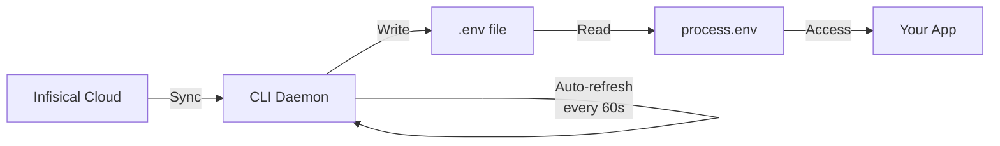
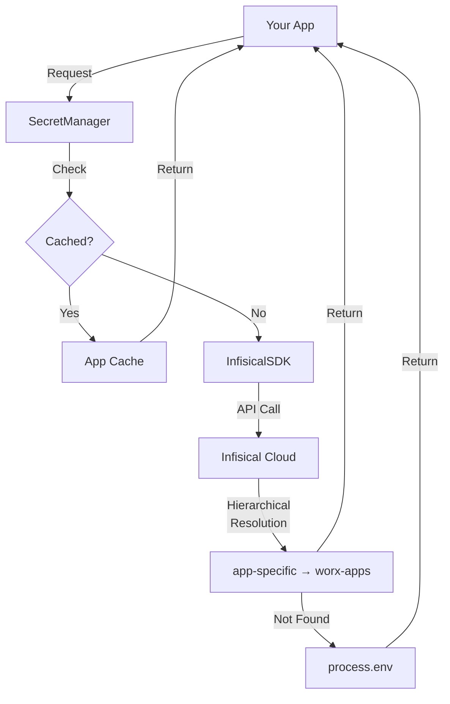

# Secrets Management Guide

## Overview

This template uses **Infisical** for centralized secrets management with two approaches:
1. **Infisical CLI Auto-Sync** (Recommended) - Automatically syncs secrets to local `.env` files
2. **SDK Integration** - Direct API access with hierarchical resolution and fallback

## Quick Start - CLI Auto-Sync (Recommended)

### 1. Install Infisical CLI

```bash
# macOS
brew install infisical/get-cli/infisical

# Linux/WSL
curl -1sLf 'https://dl.cloudsmith.io/public/infisical/infisical-cli/setup.release.sh' | sudo -E bash

# Windows
scoop install infisical
```

### 2. Login and Initialize

```bash
# Login to Infisical
infisical login

# Initialize project (creates .infisical.json)
infisical init
```

### 3. Start Auto-Sync Daemon

```bash
# Auto-sync every 60 seconds to .env file
infisical run --daemon --env=dev --path=/ --interval=60

# Or add to package.json for convenience
yarn secrets:sync  # Starts the daemon
```

The daemon will:
- Automatically sync secrets to `.env` file
- Update when secrets change in Infisical
- Handle authentication refresh
- Work offline after initial sync

### 4. Use in Development

```bash
# Your app just reads from process.env - no SDK needed!
yarn dev  # Reads from .env automatically
```

## Alternative: SDK Integration

If you need programmatic access or dynamic updates:

### 1. Setup Credentials

```bash
# Best practice: Add to ~/.zshrc or ~/.bashrc for all projects
export INFISICAL_CLIENT_ID="your-machine-identity-client-id"
export INFISICAL_CLIENT_SECRET="your-machine-identity-client-secret"
export INFISICAL_APPS_PROJECT_ID="10b63b16-515c-4ea4-adfc-1da96d654fe8"

# Then reload shell
source ~/.zshrc  # or ~/.bashrc

# No need for .env.local with credentials!
```

### 2. Use SecretManager

```typescript
import { secretManager } from '@adaptiveworx/shared/config';

// Application secrets (from worx-apps or app-specific project)
const apiKey = await secretManager.getRequiredSecret('API_KEY');

// Platform/infrastructure secrets (from worx-platform)
const awsKey = await secretManager.getPlatformSecret('AWS_ACCESS_KEY_ID');
```

## Approach Comparison

### CLI Auto-Sync (Recommended for Most Cases)

**Pros:**
- ✅ Simple - just read from `process.env`
- ✅ Works offline after sync
- ✅ No custom code needed
- ✅ Automatic updates via daemon
- ✅ Standard `.env` workflow

**Cons:**
- ❌ Requires CLI installation
- ❌ Secrets stored on disk (in `.env`)
- ❌ No programmatic CRUD operations

**Best for:** Local development, simple deployments, standard applications

### SDK Integration (Current Implementation)

**Pros:**
- ✅ Dynamic updates without restart
- ✅ No secrets on disk
- ✅ Programmatic CRUD operations
- ✅ Hierarchical project resolution
- ✅ Works in serverless/containers

**Cons:**
- ❌ More complex setup
- ❌ Network dependency
- ❌ Custom caching logic

**Best for:** Production, microservices, dynamic environments

## How It Works

### CLI Auto-Sync Flow



### SDK Integration Flow (Current Implementation)



### Hierarchical Resolution (SDK Only)

Secrets are resolved with this priority (most specific wins):

1. **App-specific** (`INFISICAL_APP_PROJECT_ID` → `worx-{appname}`) - Optional, for app-specific secrets
2. **Shared apps** (`INFISICAL_APPS_PROJECT_ID` → `worx-apps`) - Default for all application secrets
3. **Environment variables** (fallback) - Local `.env` files

**Note:** `worx-platform` (`INFISICAL_PLATFORM_PROJECT_ID`) contains infrastructure/platform secrets (AWS keys, monitoring, etc.) and is managed separately, not part of the application hierarchy.

**Example:**
```typescript
// Default behavior (most common):
// Tries: worx-apps → process.env
const apiKey = await secretManager.getSecret('API_KEY');

// With app-specific project:
// Set INFISICAL_APP_PROJECT_ID=<your-app-project-id>
// Tries: worx-myapp → worx-apps → process.env
const appSpecificKey = await secretManager.getSecret('CUSTOM_API_KEY');
```

### SecretManager API

```typescript
import { SecretManager, getSecretManager } from './config/secrets';

// Create instance
const sm = new SecretManager({
  appName: 'myapp',      // Optional: enables app-specific project
  environment: 'dev'     // Optional: defaults to NODE_ENV or 'dev'
});

// Get secret (throws if not found)
const value = await sm.getSecret('API_KEY');

// Get with default
const port = await sm.getSecretOrDefault('PORT', '3000');

// Get multiple
const secrets = await sm.getSecrets(['DB_URL', 'API_KEY']);

// Health check
const health = await sm.healthCheck();
console.log(health.status); // 'healthy' | 'degraded' | 'unhealthy'

// Singleton pattern
const sm2 = getSecretManager();
```

## Commands

### Infisical Loader

```bash
# Load secrets to .env.local
yarn infisical:load                 # dev environment
yarn infisical:load:dev             # explicit dev
yarn infisical:load:stg             # staging
yarn infisical:load:prd             # production

# Validate connectivity
yarn infisical:validate

# Show secrets (don't write)
yarn infisical:show

# Custom output file
yarn infisical:load --output=.env.custom
```

### Health Check

```bash
# Check Infisical connectivity
yarn config:health

# Output:
# {
#   "status": "healthy",
#   "message": "All Infisical projects accessible",
#   "projects": [
#     { "name": "worx-apps", "accessible": true },
#     { "name": "worx-platform", "accessible": true }
#   ]
# }
```

## Configuration

### Quality Thresholds

These are automatically loaded from Infisical:

**worx-apps project (baseline):**
```bash
TYPE_COVERAGE_MIN=98.5
LINT_MAX_WARNINGS=0
TEST_COVERAGE_MIN=80
```

**Loaded via:**
```bash
yarn infisical:load
source .env.local
yarn quality:validate  # Uses loaded thresholds
```

### App-Specific Secrets

For app-specific secrets (API keys, DB credentials):

1. Create app-specific Infisical project: `worx-myapp`
2. Set `INFISICAL_APP_PROJECT_ID` in `.env.local`
3. Add secrets to `worx-myapp/{env}/` in Infisical

**Precedence:**
```
worx-myapp/dev/API_KEY       # Highest priority
  ↓ (if not found)
worx-apps/dev/API_KEY        # Shared apps
  ↓ (if not found)
worx-platform/dev/API_KEY    # Platform fallback
  ↓ (if not found)
process.env.API_KEY          # Environment variable
```

## Local Development Without Infisical

**Option 1: Environment variables only**
```bash
# .env.local (no Infisical credentials)
TYPE_COVERAGE_MIN=98.5
LINT_MAX_WARNINGS=0
TEST_COVERAGE_MIN=80
API_KEY=local-dev-key

# Load into shell
source .env.local
```

**Option 2: Use package.json defaults**
```bash
# No .env.local needed
# package.json has default thresholds
yarn build
yarn test
```

## CI/CD Setup

**GitHub Actions:** (already configured in .github/workflows/ci.yml)

```yaml
env:
  INFISICAL_PLATFORM_PROJECT_ID: ${{ secrets.INFISICAL_PLATFORM_PROJECT_ID }}
  INFISICAL_APPS_PROJECT_ID: ${{ secrets.INFISICAL_APPS_PROJECT_ID }}
  INFISICAL_CLIENT_ID: ${{ secrets.INFISICAL_CLIENT_ID }}
  INFISICAL_CLIENT_SECRET: ${{ secrets.INFISICAL_CLIENT_SECRET }}
```

**Required GitHub Secrets:**
- `INFISICAL_PLATFORM_PROJECT_ID`
- `INFISICAL_APPS_PROJECT_ID`
- `INFISICAL_CLIENT_ID`
- `INFISICAL_CLIENT_SECRET`

## Troubleshooting

### "No Infisical projects configured"

**Cause:** Environment variables not set

**Fix:**
```bash
source .env.local
yarn infisical:validate
```

### "Secret not found in any project"

**Cause:** Secret doesn't exist in any Infisical project

**Fix:**
1. Add secret to Infisical (worx-apps or worx-platform)
2. Or add to `.env.local` as fallback

### "Infisical connectivity check failed"

**Cause:** Invalid credentials or network issue

**Fix:**
```bash
# Verify credentials
echo $INFISICAL_CLIENT_ID
echo $INFISICAL_CLIENT_SECRET

# Test connection
yarn infisical:validate
```

### Type coverage validation fails

**Cause:** Thresholds not loaded from Infisical

**Fix:**
```bash
# Load thresholds
yarn infisical:load
source .env.local

# Validate
yarn quality:validate
```

## Security Best Practices

1. **Never commit** `.env.local` or `.env.*` files (gitignored)
2. **Rotate credentials** regularly in Infisical
3. **Use app-specific projects** for sensitive secrets
4. **Audit access** via Infisical dashboard
5. **Least privilege** - only grant necessary permissions

## Example Workflow

**New developer onboarding:**

```bash
# 1. Clone repo
git clone https://github.com/adaptiveworx/my-project
cd my-project

# 2. Setup Infisical
cp .env.example .env.local
# Add INFISICAL_CLIENT_ID and INFISICAL_CLIENT_SECRET

# 3. Load secrets
source .env.local
yarn infisical:validate  # Verify connectivity
yarn infisical:load      # Bootstrap .env.local

# 4. Develop
yarn install
yarn dev
```

**Switching environments:**

```bash
# Load staging secrets
yarn infisical:load:stg
source .env.local

# Verify
yarn config:health
# Shows: "environment": "stg"

# Run tests against staging
yarn test
```
